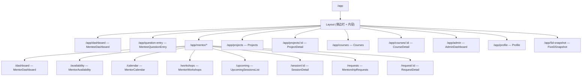
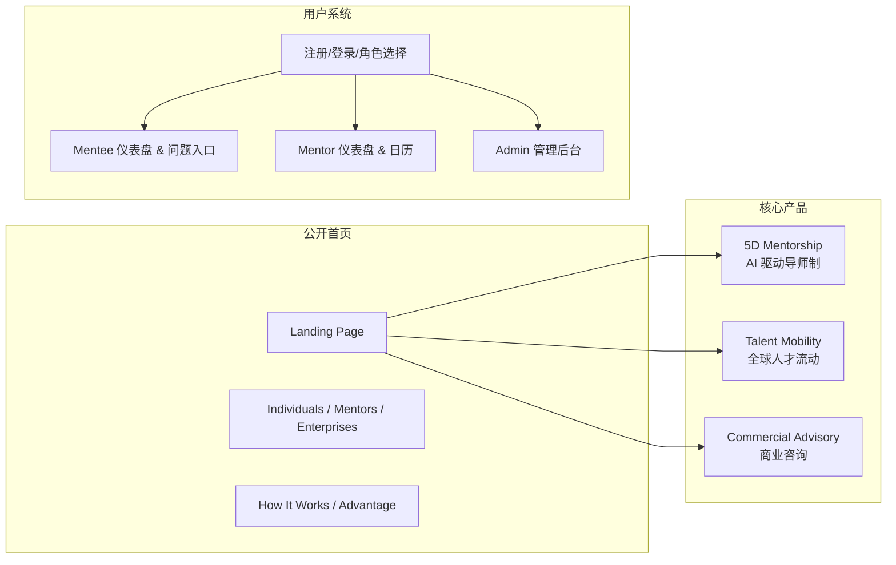

# PhxNorth 网站结构分析

## 概述

**PhxNorth** 是一个 **AI-Native 人力资本基础设施平台**（AI-Native Human Capital Infrastructure），提供 AI 驱动的 5D 导师制、全球人才流动和战略商业咨询服务。

---

## 技术栈

| 类别 | 技术 | 版本 |
|------|------|------|
| **框架** | React | 18.3.1 |
| **打包工具** | Vite | 6.3.5 |
| **语言** | TypeScript | — |
| **CSS** | TailwindCSS | 4.1.12 |
| **UI 组件库** | Radix UI (shadcn/ui) + MUI | — |
| **路由** | React Router | 7.13.0 |
| **动画** | Motion (Framer Motion) | 12.23.24 |
| **图表** | Recharts | 2.15.2 |
| **部署** | Vercel | — |

---

## 目录结构

```
PhxNorth/
├── index.html              # 入口 HTML，含 SEO meta 标签
├── package.json            # 项目依赖配置
├── vite.config.ts          # Vite 配置（含自定义 Figma 资产插件）
├── vercel.json             # Vercel 部署配置（SPA 回退 + 安全头）
├── tsconfig.json           # TypeScript 配置
├── postcss.config.mjs      # PostCSS 配置
├── public/
│   └── logo.svg            # 站点 Logo
└── src/
    ├── main.tsx            # React 应用入口
    ├── styles/
    │   ├── index.css       # 全局样式入口
    │   ├── tailwind.css    # Tailwind 导入
    │   ├── theme.css       # 主题变量（颜色、间距等）
    │   └── fonts.css       # 字体配置
    ├── app/
    │   ├── App.tsx         # 根组件（RouterProvider）
    │   ├── routes.tsx      # 完整路由配置
    │   ├── pages/          # 📄 48 个页面组件
    │   └── components/
    │       ├── Layout.tsx  # 应用内部布局（含侧边栏）
    │       ├── figma/      # Figma 相关组件
    │       └── ui/         # 🧩 48 个 shadcn/ui 基础组件
    ├── imports/            # 📋 66 个设计/规范文档
    └── assets/             # 静态资源
```

---

## 路由架构

### 公开页面（无需登录）

| 路径 | 页面组件 | 说明 |
|------|---------|------|
| `/` | `Landing` | 首页（91KB，最大页面）|
| `/individuals` | `Individuals` | 个人用户介绍 |
| `/mentors` | `Mentors` | 导师介绍 |
| `/enterprises` | `Enterprises` | 企业介绍 |
| `/how-it-works` | `HowItWorks` | 运作方式 |
| `/advantage` `/why-phxnorth` | `Advantage` | 平台优势 |
| `/5d-mentorship` | `FiveDMentorship` | 5D 导师制介绍 |
| `/talent-mobility` | `TalentMobility` | 人才流动介绍 |
| `/commercial-advisory` | `CommercialAdvisory` | 商业咨询介绍 |
| `/profile/:name` | `PublicProfile` | 公开个人主页 |

### 探索页面（Explore）

| 路径 | 页面组件 |
|------|---------|
| `/workshops` | `WorkshopsExplore` |
| `/instant-mentorship` | `InstantMentorshipExplore` |
| `/structured-mentorship` | `StructuredMentorshipExplore` |
| `/mentorship-programs` | `MentorshipProgramsExplore` |
| `/global-talent-mobility` | `GlobalTalentMobilityExplore` |
| `/commercial-consultation` | `CommercialConsultationExplore` |

### 认证/注册流程

| 路径 | 页面组件 | 说明 |
|------|---------|------|
| `/login` | `Login` | 登录 |
| `/account-type-selection` | `AccountTypeSelection` | 选择账户类型 |
| `/login-type-selection` | `LoginTypeSelection` | 选择登录方式 |
| `/role-selection` | `RoleSelection` | 角色选择 |
| `/role-selection-new` | `RoleSelectionNew` | 新角色选择 |
| `/create-account` | `CreateAccount` | 创建账户 |
| `/welcome` | `PreRoleWelcome` | 欢迎页 |

### 应用内部路由（`/app/*`，使用 Layout 包裹）



### 人才流动子系统

| 路径 | 页面组件 |
|------|---------|
| `/talent-mobility-portal` | `TalentMobilityPortal` |
| `/talent-mobility-portal/preferences` | `TalentMobilityPreferences` |
| `/talent-mobility-portal/campaigns` | `TalentMobilityCampaigns` |
| `/talent-mobility-portal/referrals` | `TalentMobilityReferrals` |
| `/talent-mobility-portal/notifications` | `TalentMobilityNotifications` |

---

## UI 组件库（48 个 shadcn/ui 原子组件）

基于 **Radix UI** 的完整 shadcn/ui 组件集，位于 `src/app/components/ui/`：

````carousel
**表单 & 输入**
- `button`, `input`, `textarea`, `checkbox`, `radio-group`
- `select`, `switch`, `slider`, `toggle`, `toggle-group`
- `calendar`, `input-otp`, `form`, `label`
<!-- slide -->
**展示 & 反馈**
- `card`, `badge`, `alert`, `skeleton`, `progress`
- `avatar`, `separator`, `aspect-ratio`
- `chart` (Recharts 封装), `table`
<!-- slide -->
**导航 & 布局**
- `accordion`, `tabs`, `collapsible`, `scroll-area`
- `navigation-menu`, `menubar`, `breadcrumb`, `pagination`
- `sidebar`, `resizable`, `carousel`
<!-- slide -->
**覆盖层 & 弹出**
- `dialog`, `drawer`, `sheet`, `alert-dialog`
- `popover`, `tooltip`, `hover-card`
- `dropdown-menu`, `context-menu`, `command`
- `sonner` (toast 通知)
<!-- slide -->
**工具**
- `utils.ts` — `cn()` 类名合并工具
- `use-mobile.ts` — 移动端检测 Hook
````

---

## 核心业务模块



---

## 关键特征

1. **纯前端 SPA** — 无后端 API 调用，所有数据为前端模拟（Mock）
2. **Figma 资产插件** — `vite.config.ts` 中自定义了 `figmaAssetPlugin()`，用于将 `figma:asset/` 虚拟导入解析为实际文件
3. **代码分割优化** — Vite 配置了手动 chunk 拆分（vendor / router / ui / charts / motion）
4. **安全头配置** — Vercel 配置了 `X-Content-Type-Options`, `X-Frame-Options`, `X-XSS-Protection`, `Referrer-Policy`
5. **丰富的设计文档** — `src/imports/` 包含 66 个 Markdown/TSX 设计规范文档，记录了各模块的设计迭代历史

---

## 页面体量排行（Top 5）

| 页面 | 文件大小 | 说明 |
|------|---------|------|
| `MenteeDashboard.tsx` | 107 KB | 学员仪表盘，最复杂的页面 |
| `Landing.tsx` | 91 KB | 首页，大量营销内容 |
| `MentorDashboard.tsx` | 56 KB | 导师仪表盘 |
| `MenteeQuestionEntry.tsx` | 53 KB | 学员问题入口 |
| `MenteeProfileSetup.tsx` | 50 KB | 学员资料设置 |
